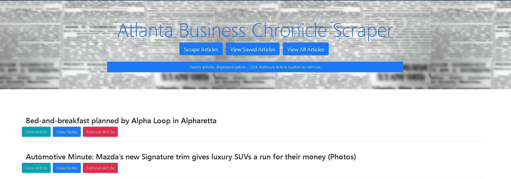

# newsScraper

## Overview

A web app that lets users view and leave comments on the latest news headlines from the Atlanta Business Chronicles.  App utilizes Axios to retrieve and Cheerio to scape headline data and news links from the web page and MongoDB / Mongoose to hadle the database side.

## Packages Required:

[Axios](https://www.npmjs.com/package/axios)

[Cheerio](https://www.npmjs.com/package/cheerio)

[Express](https://www.npmjs.com/package/express)

[Mongoose](https://www.npmjs.com/package/mongoose)

[Morgan](https://www.npmjs.com/package/morgan)

## Installation

In order to run this application locally you will need to install the following npm packages (as referenced above):

* npm install axios
* npm install cheerio
* npm install express
* npm install mongoose
* npm install morgan

## Usage

Application deployed on [Heroku](https://intense-sea-39339.herokuapp.com/)

### In the header section:

* Click the `Scrape Articles` button to retrieve and scrape the latest headlines.  Once retrieved the articles will populate the body of the page.  It may take several seconds for the scrape to complete.  Clicking to scrape again will retrieve the lastest news headline; prior headlines are not deleted.

* The `View Saved Articles` button will display only the articles saved for later reading.

* The `View All Articles` button will return to the page with all scraped articles.

***

### On the 'View All Articles' page:

* Each article will have a button to view the actual article on the Atlanta Business Chronicle website.

* Each article will have a button to save notes for future reference.

* Each article will have a button to save the article for future reference.  If the article has already been saved, this button will disappear and the article will be marked as saved.

***

### Viewing and Saving Notes:

* Multiple notes may be saved for an article.

* Notes may be deleted as desired.

***

### On the 'Saved Articles' page:

* Each article will have a button to view the actual article on the Atlanta Business Chronicle website.

* Each article will have a button to save notes for future reference.

* Each article will have a button to remove the article from the saved list.

***

## Disclaimer

This app was designed for educational purposes and is for personal use only. 

